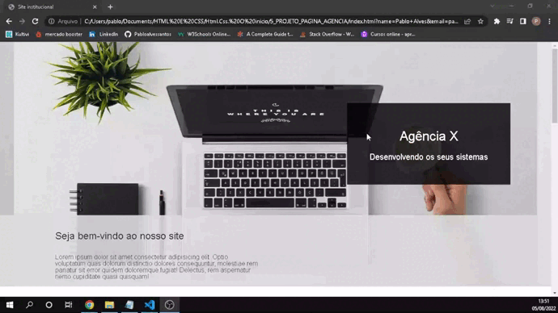

<h1 align="center">CADASTRO DE VEÍCULO</h1>

<h1 align="center">
    
</h1>

 

<h2 align="center">
   <a href=https://cadastroveiculos-pablo.netlify.app">Acessar a demonstração</a>
<h2>

 

## 📕 Sobre o projeto 

O **One Page** e um site  a onde pessoas podem ter acesso a serviços de desenvolvimento de sites, esse projeto trabalhei bastante em questões de seções com tag div e section, desenvolvi o projeto com html e css.

## 🛠 Tecnologias

As seguintes ferramentas foram usadas na construção do projeto:

- HTML
- CSS Puro

Desenvolvido por **Pablo alves santos**

Meu Linkedin: [Pablo.A](https://www.linkedin.com/in/pablo-santos-6b6460243/)
